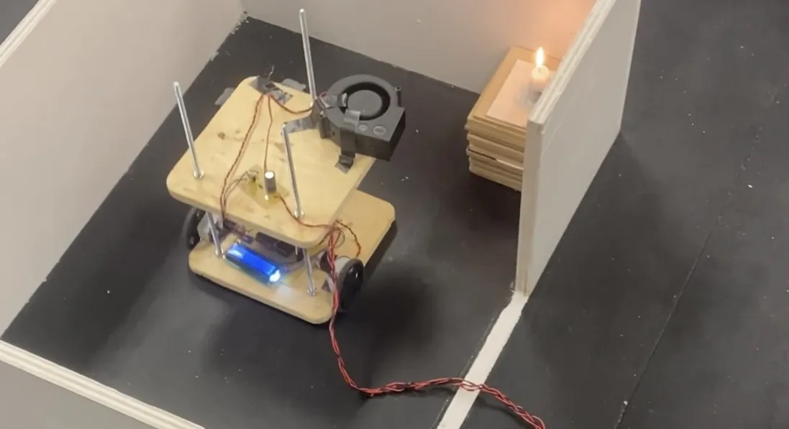
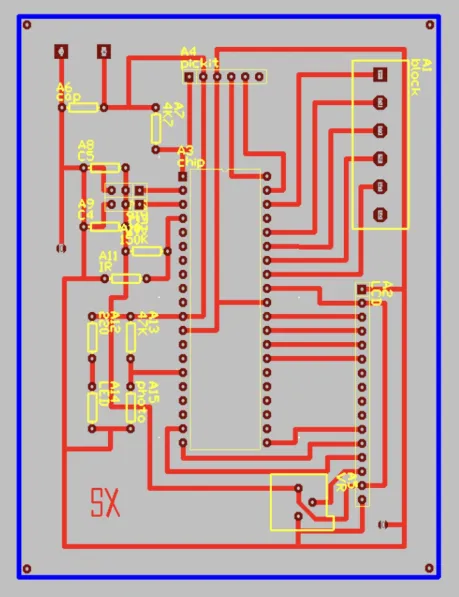
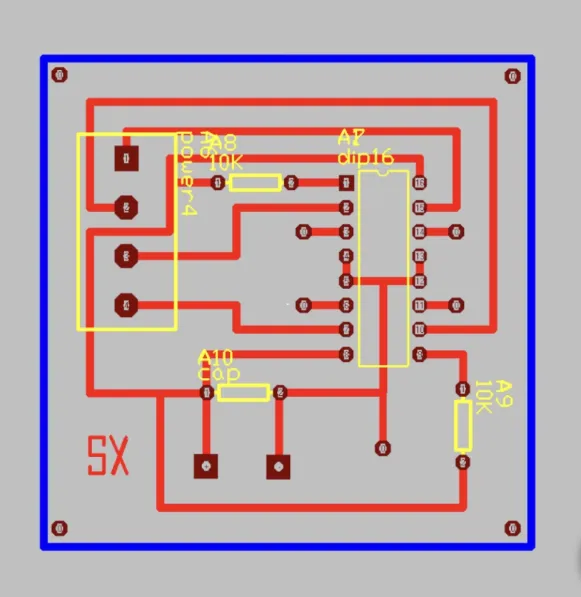
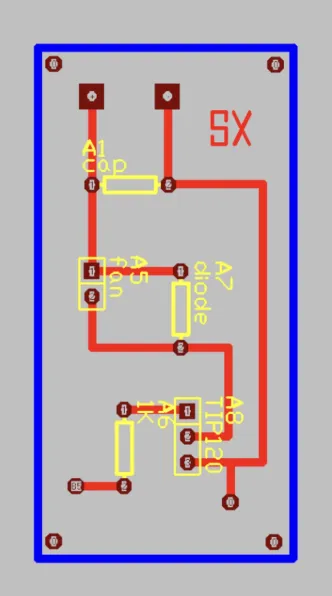
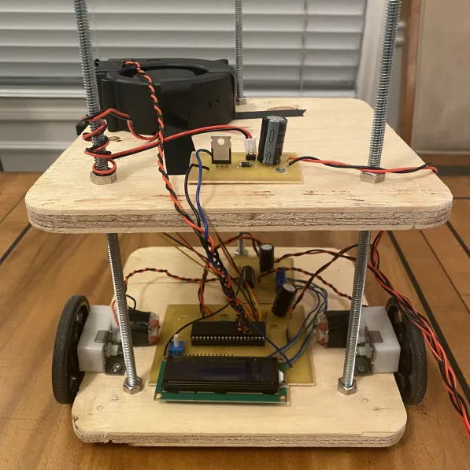
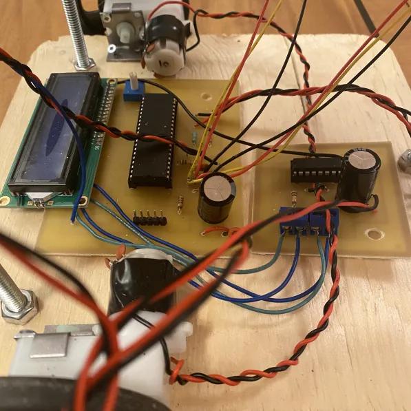

# Firefighter Robot

A fully autonomous robot with fire-extinguishing abilities. The bot uses infrared line sensors, distance sensors,
DC motors, an LCD, and a PIC microcontroller to accurately navigate through a maze and blow out a flame.
Three PCBs were custom-designed using TraxMaker then printed, etched, and drilled in preparation for the soldering of components.
The code is written in BASIC.

### Video demo:

### Schematic diagrams:
| Motherboard                            | Motorboard                          | Flameboard                          |
|----------------------------------------|-------------------------------------|-------------------------------------|
|   |  |  |

### Images:
|                          |                                  |
|--------------------------|----------------------------------|
|  |  |

This project was for TEJ4MI: Computer Engineering Technology.